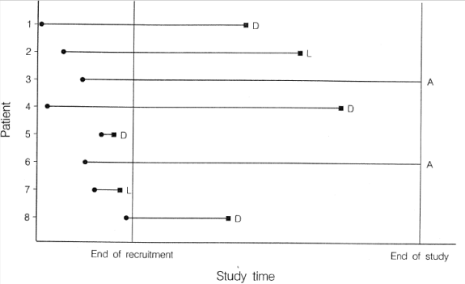

## 생존분석의 조건
1. 시간데이터의 시작과 끝을 알아야함.
2. 기대 수명을 재는것이 생존분석

## 생존분석에서 회귀분석을 그냥 사용하지 못하는 이유
1. 종료시점이 정규분포를 따르지않는다. 보통 오른쪽 꼬리를 강하게 가지 분포를 가진다. (heavily right skewed.) (보통 right skewed로 되어있는 분포들에서 적합하다.)
2. 항상 데이터를 끝까지 관측 할 수 있는 것은 아님. 시간과 돈의 문제로 연구를 종료하거나 데이터 수집이 끊겨 관측 데이터가 끊어질 수 있다. (censoring and truncation) (이게 핵심 이유)
3. 매 시간마다 데이터가 계속 달라짐. 공분산 등에 계속 반영해야하는 문제 (선형회귀분석에서는 정해진 값에서 예측을하지만, 여기선 변하는데이터를 반영할 수 있는 것)

## data 종류
1. 연구 시작과 함께 데이터 수집을 시작해서 event가 끝난 경우.
2. 연구 시작보다 늦게 데이터 수집을 시작해서 event가 끝난 경우.
3. 연구가 종료돼서 event종료를 보지 못한 경우 -> censoring
4. 연구 보다 늦게 시작해서 event가 끝나지 않았는데 데이터 수집이 종료된 경우 -> censoring

## 용어설명
- 시간: 상대적인 개념으로의 시간. 즉, 분석하려는 대상을 관찰하기 시작한 시점으로부터 경과한 시간
- 사건: 생존의 반대 개념. 사건은 한 번만 일어나게 되며 0(일어나지 않음 또는 censored), 1(일어남)으로 표현한다.
생존분석에서는 보통 death, event, failed를 전부 같은 의미로 받아들이면 된다.

## Censored data 란?
- 생존 분석 데이터의 중요한 특징 중 하나로 데이터를 부분적으로만 관찰한 상태이다.
- 일반적인 regression 분석과의 차이를 만들어주는 데이터의 특징으로 생존 분석을 더 특별하고 까다롭게 만들어주는 특성이라 할 수 있다.

## Right Censored 란?
- 대상에 아직 사건이 발생하지 않았지만, 연구가 종료되어 더이상 관찰하지 않는 데이터.
- 연구 종료 전 기타 다양한 이유(진료를 더이상 나오지 않음, 교통사고로 사망)로 관찰이 종료된 것 등
- If only the limit I for the true event time T is known such that T > I, this is called right censoring.

## Censoring data

- D는 death(event)를 의미
- L은 다른이유로 관찰이 종료
- A는 생존했지만 연구가 종료
- L과 A가 censored data 라고 할 수 있음

## censored data에 대한 직관: 어떻게 deathtime 을 평균낼 수 있을까?
1. censored data의 deathtime을 우리가 예측하면 안될까?
2. censored data를 그냥 버리면 안될까?
- 두가지 방법 모두 unbiased 문제가 발생한다.

## Example : Randomized clinical trial on effectiveness of prednisone for treating cirrhosis of the liver (간치료를 위해 위약을 부여)
1962년 ~1969년, 여러 병원에서 488명의 간경변증 환자가 '스테로이드 프레드니손' VS '비활성 위약'에 대한 무작위 임상 시험에 포함되었습니다.
- 목적: 프레드니손은 환자가 더 오래 생존할 수 있도록 하나요?
- Time origin: calendar time of randomization (study entry)
- Event of interest: 사망 (death)
- 관련 시간 변수: time of death - time of randomization

### 과정
> 임상시험에 참여한 환자들은 1974년 9월까지 추적조사를 받았습니다.

> 이때까지 294명의 환자가 사망했습니다(위약 환자 152명, 프레드니손 환자 142명).

> 임상시험이 끝났을 때 살아남은 환자들의 사망 시간에 대해 우리는 무엇을 알고 있습니까?
> - 연구 시작부터 연구 종료까지 경과된 시간
> - 이 기간 동안 사망은 발생하지 않았습니다. ⇒ 사망 시간은 최소한 그 이상입니다.

### 예시
> Fred가 1969년 12월 31일에 무작위로 치료를 받고 1974년 9월 30일까지 시험에 남아 있었다면 Fred는 최소 1734일을 살았습니다.

> 그러한 관찰은 censored 됩니다. 분명히 censored된 관측값에는 관심 있는 사건 시간에 대한 정보가 포함되어 있습니다. Collett(§1.2)은 몇 가지 다른 유사한 예를 제공합니다.

